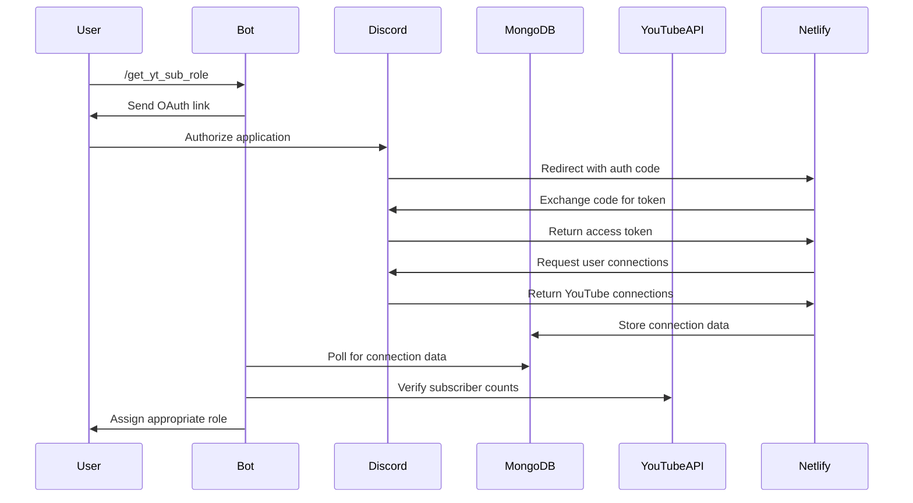

# YouTube Integration

Kiyo offers a robust YouTube integration system that allows server members to verify their YouTube channels and receive roles based on their subscriber counts.

## Features

- **OAuth2 Authentication**: Secure verification of YouTube channel ownership through Discord's OAuth2 system
- **Subscriber Role Assignment**: Automatic role assignment based on subscriber count milestones
- **Multiple Channel Support**: Users with multiple YouTube channels get the role for their highest subscriber count
- **Secure Data Handling**: All sensitive data is encrypted and securely stored

## How It Works

1. **Initiation**: A user runs the `/get_yt_sub_role` command
2. **Authorization**: The user is directed to authorize the application with their Discord account
3. **Connection Verification**: The system checks for YouTube connections on the user's Discord account
4. **Subscriber Count Verification**: The API fetches the subscriber count for each connected YouTube channel
5. **Role Assignment**: The user is assigned a role based on their highest subscriber count

## Subscriber Role Tiers

The following subscriber count tiers are available:

- Less than 100 Subs
- 100 - 499 Subs
- 500 - 999 Subs
- 1K - 4.9K Subs
- 5K - 9.9K Subs
- 10K - 49.9K Subs
- 50K - 99.9K Subs
- 100K - 499.9K Subs
- 500K - 999.9K Subs
- 1M+ Subs

## Technical Implementation

The YouTube integration uses several components:

1. **Discord OAuth2 API**: For authenticating users and accessing their connections
2. **YouTube Data API**: For verifying subscriber counts
3. **MongoDB**: For storing verification data and role assignments
4. **Netlify Functions**: For handling the OAuth2 callback and processing verification

### OAuth Flow

## Setting Up YouTube Integration

To set up the YouTube integration for your own instance of Kiyo:

1. Create a Discord application in the Discord Developer Portal
2. Enable the "Connections" OAuth2 scope
3. Set up a redirect URI (typically using Netlify Functions)
4. Configure the required environment variables:
    - `DISCORD_CLIENT_ID`
    - `DISCORD_CLIENT_SECRET`
    - `DISCORD_REDIRECT_URI`
    - `YOUTUBE_API_KEY`

## Troubleshooting

Common issues and their solutions:

- **No YouTube connections found** : The user needs to connect their YouTube account to Discord first
- **Authorization timeout** : The OAuth flow took too long to complete, try again
- **Failed to retrieve subscriber count** : Check your YouTube API key and quota limits
